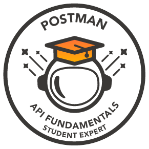
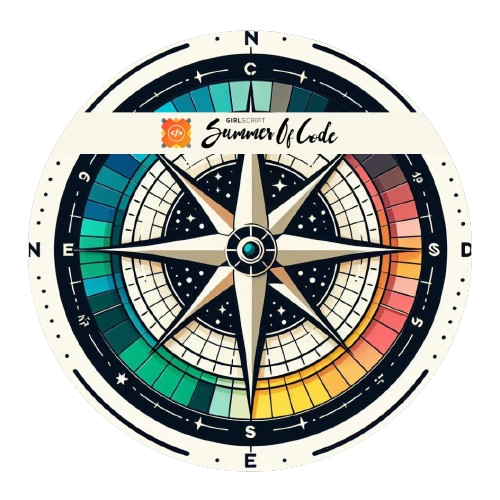
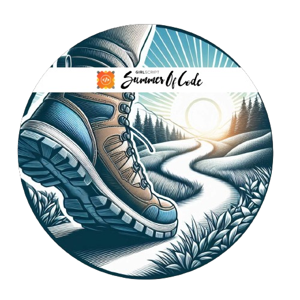
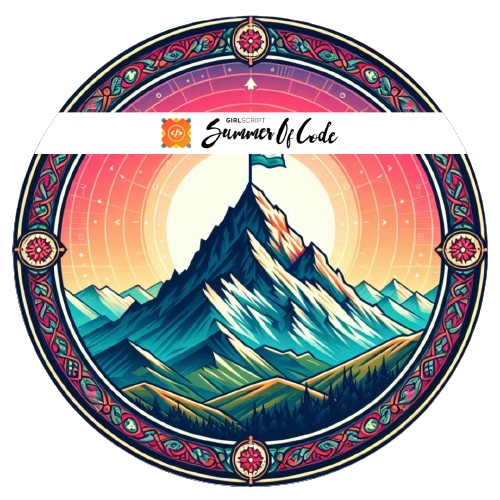
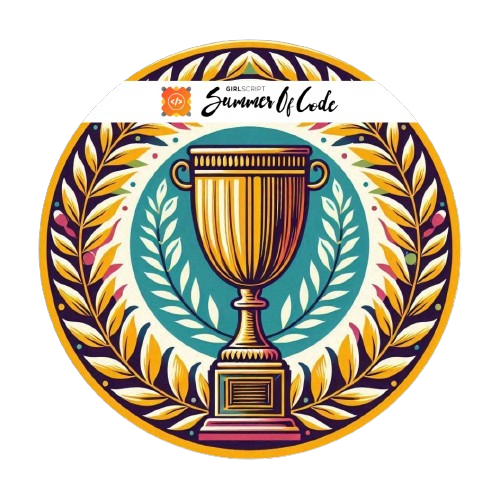
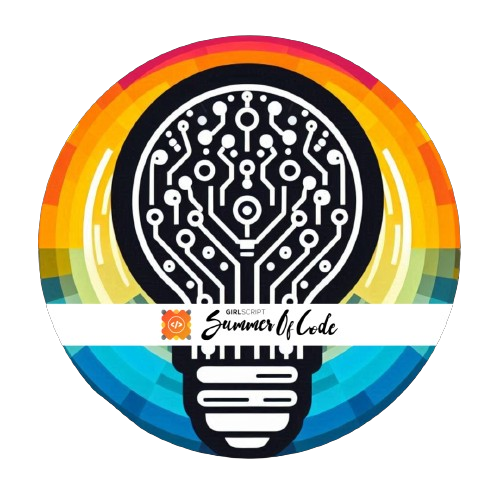
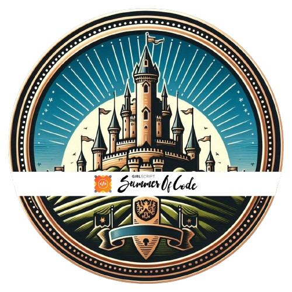
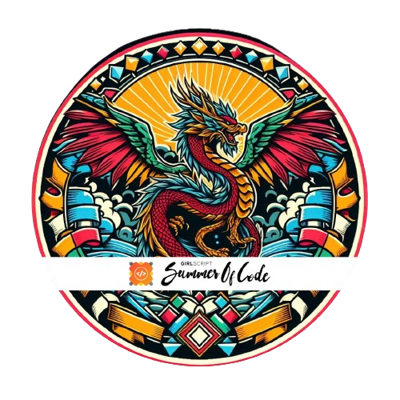

<h1>Hey there, Hem Raj this side!</h1>

 

### 💫 About Me

- 🎓 I'm a Student and Web Developer
- 🌱 I’m currently learning next.js
- 👯 I’m looking to collaborate with open source enthusiasts
- 🥅 2024 Goals: Learn Reactjs and Nextjs

 

### 🌐 Socials:

  

### </>💻 Languages & Tools :

  

  

### 📊 GitHub Stats:

<!--

-->

 

## 🎖 Badges

### GSSoC'24 Badges

<a href="https://gssoc.girlscript.tech/leaderboard">

  
  
  
  
  
  
  
  

 

  
<b> HoloPin Badges </b>

  

 

  <b>Thanks for your visit to my profile!😊</b>

<!--

  

-->

